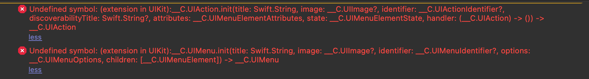

# React Native Multiple Image Picker (RNMIP)

<p align="center">
  
</p>

React Native Multiple Image Picker enables application to pick images and videos from multiple smart album in iOS/Android, similar to the current Facebook App. React Native Multiple Image Picker is based on two libraries available, [TLPhotoPicker](https://github.com/tilltue/TLPhotoPicker) and [PictureSelector](https://github.com/LuckSiege/PictureSelector)

## Demo 👉👈

| iOS | Android  |
| ------------- | ------------- |
|   |    |

## Installation

```sh
npm i @baronha/react-native-multiple-image-picker
or
yarn add @baronha/react-native-multiple-image-picker
```

### iOS
> Don't forget the Privacy Description in `info.plist`.


```sh
cd ios/ && pod install
```
## issue
For sure, you will get this error when launching the application


Dont worry, You just need to go to `Pods/Pods/TLPhotoPicker/TLPhotosPickerViewController.swift` and comment all lines, like this: 


I will fix it soon in the future.

### Android
> Add Permission in `AndroidManifest.xml`
```xml
    <uses-permission android:name="android.permission.CAMERA" />
    <uses-permission android:name="android.permission.WRITE_EXTERNAL_STORAGE" />
    <uses-permission android:name="android.permission.READ_EXTERNAL_STORAGE" />
```

## Usage
See [options](#Options)
```js
import MultipleImagePicker from "react-native-multiple-image-picker";
// ...
const response = await MultipleImagePicker.openPicker(options);
```
## Features

- [x] Selected order index. 
- [x] Support smart album collection. 
- [x] Camera roll, selfies, panoramas, favorites, videos, custom users album
- [x] Support Camera
- [x] Playback video and live photos.
- [x] Just one. playback first video or live Photo in bounds of visible cell.
- [x] Display video duration.
- [x] Async phasset request and displayed cell.
- [x] Scrolling performance is better than facebook in displaying video assets collection.
- [x] Reload of changes that occur in the Photos library.
- [x] Preview photo.
...etc

## Options
``` updating... ```
#### selectedAssets (Important)
``` updating... ```
## Callback
``` updating... ```
#### Thumbnail (iOS only)

## To Do
- [ ] Crop photo.
- [ ] Multiple croping photo (Android only).
- [ ] Video Compression
- [ ] [Solve iOS error](##issue)

## Performance

We're trying to improve performance. If you have a better solution, please open a [issue](https://github.com/baronha/react-native-multiple-image-picker/issues)
or [pull request](https://github.com/baronha/react-native-multiple-image-picker/pulls). Best regards!

## Contributing

See the [contributing guide](CONTRIBUTING.md) to learn how to contribute to the repository and the development workflow.

## License

MIT
