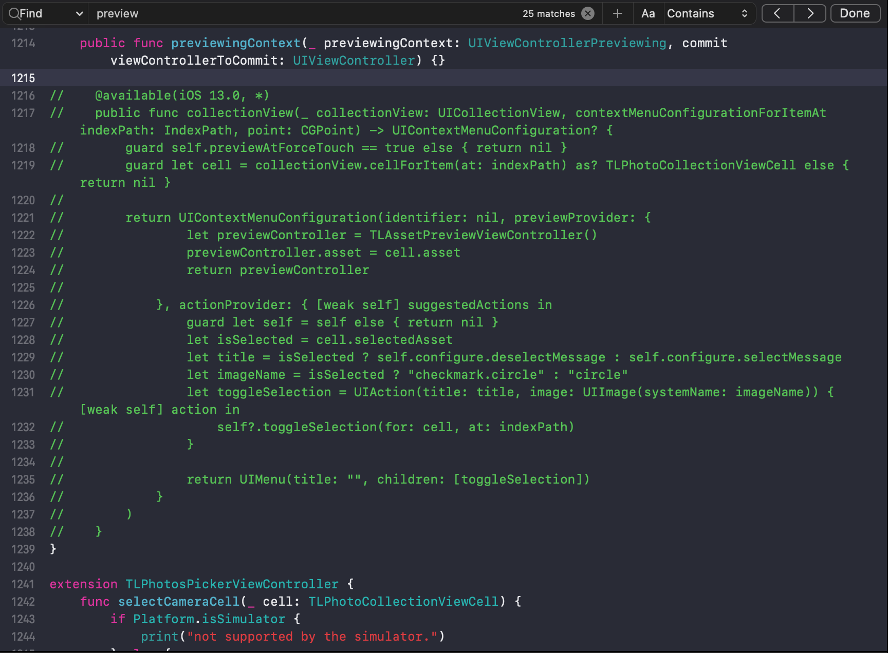

# React Native Multiple Image Picker (RNMIP)

<p align="center">
  
</p>

React Native Multiple Image Picker enables application to pick images and videos from multiple smart album in iOS/Android, similar to the current Facebook App. React Native Multiple Image Picker is based on two libraries available, [TLPhotoPicker](https://github.com/tilltue/TLPhotoPicker) and [PictureSelector](https://github.com/LuckSiege/PictureSelector)

> Related: [React Native Photo Editor](https://github.com/baronha/react-native-photo-editor)

## Demo 👉👈

| iOS                                                  | Android                                                  |
| ---------------------------------------------------- | -------------------------------------------------------- |
|  |  |

## Installation

```sh
npm i @baronha/react-native-multiple-image-picker
or
yarn add @baronha/react-native-multiple-image-picker
```

### iOS

> Don't forget the Privacy Description in `info.plist` and add file [.swift](https://stackoverflow.com/questions/52536380/why-linker-link-static-libraries-with-errors-ios) in your project (and create bridging header file swift).
> 

```sh
cd ios/ && pod install
```

#### Issue

When installing this library on Xcode 12, you'll get the following error in Xcode:

```
Undefined symbol: (extension in UIKit):
__C.UIMenu.init(title: Swift.String, image: __C.UIImage?, identifier: __C.UIMenuIdentifier?, options: __C.UIMenuOptions, children: [__C.UIMenuElement]) -> __C.UIMenu

Undefined symbol: (extension in UIKit):
__C.UIAction.init(title: Swift.String, image: __C.UIImage?, identifier: __C.UIActionIdentifier?, discoverabilityTitle: Swift.String?, attributes: __C.UIMenuElementAttributes, state: __C.UIMenuElementState, handler: (__C.UIAction) -> ()) -> __C.UIAction
```

<br>

Here are some related issues in the RN repo: [Issue 30202](https://github.com/facebook/react-native/pull/30202) and [Issue 29178](https://github.com/facebook/react-native/pull/29178). This bug could be fixed in a future version of react native, but a workaround I've found is to do the following:

1. Open your `ios/project.xcworkspace` project.
2. In the project navigator panel (located on the right side of Xcode), select your project group (i.e. the item with the blueprint icon).
3. The Xcode project editor should appear. In the left panel, under the "Project" section, select your project (if it isn't already selected).
4. In the project section's top tab bar, select the "Build Settings" tab (also make sure the "All" and "Combined" tabs are selected).
5. In the project navigator list, under the "Search Path" section, there should be a "Library Search Paths" setting (alternatively, you can search for "Library Search Paths" in the search bar).
6. Change the entry `"$(TOOLCHAIN_DIR)/usr/lib/swift-5.0/$(PLATFORM_NAME)"` to `"$(TOOLCHAIN_DIR)/usr/lib/swift-5.3/$(PLATFORM_NAME)"` i.e. change `swift-5.0` to `swift-5.3` (to show the popup dialog, double click the value/item).

   - Alternatively, according to this [issue comment](https://github.com/facebook/react-native/issues/29246#issuecomment-667518920), you can clear all the items listed in the "Library Search Paths" setting. **TLDR**: Xcode automatically manages this setting, and the RN template hardcodes it to use Swift 5.0.

7. If you haven't already, make sure to create an empty swift file. Then clean the build folder (the option is in the menu bar under: "Product" -> "Clean Build Folder") and try building your project again.
8. If you are still having problems building the app, try the following and build your project again:
   - Try clearing out Xcode's `derivedData` directory: `rm -rf ~/Library/Developer/Xcode/DerivedData/*` (check out this [gist](https://gist.github.com/maciekish/66b6deaa7bc979d0a16c50784e16d697) for instructions on how to clean up Xcode)
   - Try clearing out the `Cocoapods` cache: `rm -rf "${HOME}/Library/Caches/CocoaPods"` (and then try running `pod install` again).



### Android

> Add Permission in `AndroidManifest.xml`

```xml
    <uses-permission android:name="android.permission.CAMERA" />
    <uses-permission android:name="android.permission.WRITE_EXTERNAL_STORAGE" />
    <uses-permission android:name="android.permission.READ_EXTERNAL_STORAGE" />
```

## Usage

See [options](#Options)

```js
import MultipleImagePicker from '@baronha/react-native-multiple-image-picker';
// ...
const response = await MultipleImagePicker.openPicker(options);
```

## Features

- [x] Selected order index.
- [x] Support smart album collection.
- [x] Camera roll, selfies, panoramas, favorites, videos, custom users album
- [x] Support Camera
- [x] Playback video and live photos.
- [x] Just one. playback first video or live Photo in bounds of visible cell.
- [x] Display video duration.
- [x] Async phasset request and displayed cell.
- [x] Scrolling performance is better than facebook in displaying video assets collection.
- [x] Reload of changes that occur in the Photos library.
- [x] Preview photo.
- [x] Download from iCloud.
      ...etc

## Options

| Property                                    |  Type  |                     Default value                     | Platform | Description                                                                                       |
| ------------------------------------------- | :----: | :---------------------------------------------------: | :------: | :------------------------------------------------------------------------------------------------ |
| usedCameraButton                            |  bool  |                         true                          |   Both   | Show camera button in first row                                                                   |
| mediaType                                   | string |                          all                          |   Both   | Select the media format you want. Values include `all`, `image`, `video`. Default is `all`.       |
| isPreview                                   |  bool  |                         true                          |   Both   | Allows to preview the image / video will select (iOS - Forcetouch)                                |
| maxVideoDuration                            | number |                          60                           |   Both   | Show only video with time allowed (in seconds)                                                    |
| numberOfColumn                              | number |                           3                           |   Both   | Number of columns in a row                                                                        |
| maxVideo                                    | number |                          20                           |   Both   | Number of videos allowed to select                                                                |
| maxSelectedAssets                           | number |                          20                           |   Both   | Maximum number of one selection                                                                   |
| singleSelectedMode                          |  bool  |                         false                         |   Both   | Only one image / video can be selected                                                            |
| isExportThumbnail                           |  bool  |                         false                         |   Both   | Export thumbnail image for Video type                                                             |
| [selectedAssets](#selectedassets-important) | Array  |                       undefined                       |   Both   | Images / Videos selected to mark                                                                  |
| doneTitle                                   | string |                         Done                          |   Both   | Title in button Done                                                                              |
| cancelTitle                                 | string |                        Cancel                         |   Both   | Title in button Cancel                                                                            |
| selectedColor                               | string |                        #FB9300                        |   Both   | The color of the mark in the row when the user selected                                           |
| autoPlay                                    |  bool  |                         true                          |   iOS    | Auto play video                                                                                   |
| allowedLivePhotos                           |  bool  |                         true                          |   iOS    | Allowed Live Photos type                                                                          |
| emptyMessage                                | string |                       No albums                       |   iOS    | Show string when gallery empty                                                                    |
| maximumMessageTitle                         | string |                     Notification                      |   iOS    | The title of the alert when the user chooses to exceed the specified number of pictures           |
| messageTitleButton                          | string |                     Notification                      |   iOS    | The title of button in the alert when the user chooses to exceed the specified number of pictures |
| maximumMessage                              | string | You have selected the maximum number of media allowed |   iOS    | The description of the alert when the user chooses to exceed the specified number of pictures     |
| tapHereToChange                             | string |                  Tap here to change                   |   iOS    | The sub-title in navigation bar (under albums's name in iOS)                                      |

#### selectedAssets (Important)

Get an Array value only. If you want React Native Multiple Image Picker to re-select previously selected images / videos, you need to add “selectedAssets” in [options](#Options). Perhaps I say a little bit confusing. See [Example](https://github.com/baronha/react-native-multiple-image-picker/tree/main/example) for more details.

## Response Object

| Property        |  Type  | Platform | Description                                                              |
| --------------- | :----: | :------: | :----------------------------------------------------------------------- |
| path            | string |   Both   | Selected media's path                                                    |
| filename        | string |   Both   | Selected media's filename                                                |
| localIdentifier | string |   Both   | Selected media's local identifier                                        |
| width           | number |   Both   | Selected photo/video width                                               |
| height          | number |   Both   | Selected photo/video height                                              |
| mime            | string |   Both   | Selected photo/video MIME type (image/jpeg, image/png, video/mp4 etc...) |
| type            | string |   Both   | Selected image type (image or video)                                     |
| size            | number |   Both   | Selected photo/video size in bytes                                       |
| duration        | number |   Both   | duration of the video (0 for images)                                     |

| thumbnail | string | Both | Appears only in video format and you must have set isExportThumbnail = true. See [options](#Options) |
| creationDate | string | iOS | UNIX timestamp when image was created |

## To Do

- [ ] Typescript.
- [ ] (Bug) Record Video (iOS).
- [ ] Video Compression.
- [x] iCloud.

## Performance

We're trying to improve performance. If you have a better solution, please open a [issue](https://github.com/baronha/react-native-multiple-image-picker/issues)
or [pull request](https://github.com/baronha/react-native-multiple-image-picker/pulls). Best regards!

## Contributing

See the [contributing guide](CONTRIBUTING.md) to learn how to contribute to the repository and the development workflow.

## License

MIT
<br>
[TLPhotoPicker](https://github.com/tilltue/TLPhotoPicker/blob/master/LICENSE)
<br>
[PictureSelector](https://github.com/LuckSiege/PictureSelector/blob/master/LICENSE)
